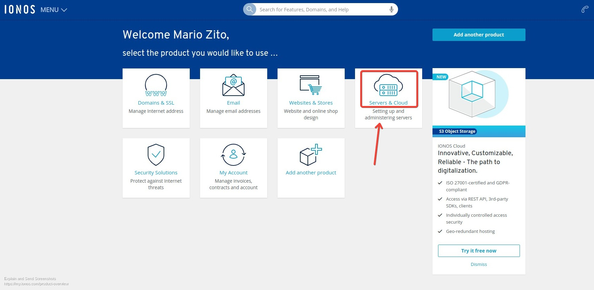

# Accediendo a nuestro servidor

Debido a que este es un servidor "pelado" (bare metal), lo único que viene instalado es el Sistema operativo (Linux Ubuntu 20.04 en nuestro caso). Debemos entonces proceder a configurar el acceso al mismo.

Despues de contratar, ya disponemos de nuestro panel de control al cual podemos ingresar en [login.ionos.com](https://login.ionos.com/) usando nuestras credenciales ingresadas al contratar:

Después de algunas preguntas de seguridad (_recuerden guardar en lugar seguro los datos con los cuales crearon su cuenta, como el ZIP codes y otros, porque se los pregunta al momento de login_), nos lleva a una página de opciones:

Elegiendo la opción indicada, pasamos al Panel de control del servidor.

 
### El panel de control ###

Este panel nos permite configurar muchos aspectos del funcionamiento de nuestr nuevo servidor:

Probablemente debamos esperar unos minutos hasta que nuestro servidor este completamente disponible, pero es bastante rápido (unos 15 minutos aprox.). Seleccionando el servidor indicado, se abre una seccion con los detalles del mismo y acciones que podemos realizar (como parar el servidor o reiniciarlo):

Los tres campos que nos importan por ahora son:

- `Host` la direccion IP pública de nuestro servidor.
- `root` es el usuario inicial con el cual se ha creado este servidor con permisos totales sobre el mismo.
- `Initial Password` es la contraseña inicial que nos han asignado y con la cual podremos ingresar al servidor.

> Nota: no explicaremos aquí como abrir una terminal/consola para operar desde la linea de comandos, ya que asumimos que alguien que pretende administrar un nodo validador debe tener al menos estos conocimientos mínimos. 

Abrimos una terminal para acceder a nuestro servidor y usamos `ssh` para ello:

 
Y luego de ingresar la contraseña ya estamos en nuestro servidor !

**Felcitaciones !** Pero aún nos queda algun trabajo para dejarlo en condiciones.

 
### Crear un usuario adicional ###

Es una (muy) mala práctica trabajar dentro del servidor como usuario `root`, por lo cual crearemos un segundo usuario con permisos de administracion. Lo llamaremos `ubuntu`. 

Los pasos son simples, y se describen bien en este tutorial [How To Create a New Sudo-enabled User on Ubuntu 20.04 [Quickstart]](https://www.digitalocean.com/community/tutorials/how-to-create-a-new-sudo-enabled-user-on-ubuntu-20-04-quickstart)

**1.** Dentro ya de la consola de nuestro servidor, ingresamos:
  ~~~
  $ adduser ubuntu
  ~~~
  donde nos preguntará la contraseña para dicho usuario:
  ~~~
  Enter new UNIX password: ...
  Retype new UNIX password: ...
  ~~~
  y (si todo está bien) responderá:
  ~~~
  passwd: password updated successfully
  ~~~

**2.** Luego, para dar permisos de administrador a este usuario, ingresamos en consola:
~~~
$ usermod -aG sudo ubuntu
~~~

**3.** Listo ! Salimos del servidor haciendo `exit` en la consola, y ya en la consola de nuestra PC podemos ingresar con nuestro nuevo usuario y contraseña:
~~~~
$ ssh ubuntu@74.208.151.236
~~~~

Ya estamos en nuestro servidor y listos para comenzar a armar nuestro nodo validador.

> Para terminar de configurar correctamente nuestro servidor, deberíamos implementar el acceso via clave pública (ssh). No lo explicaremos aquí, pero este es un buen tutorial: [How To Set up SSH Keys on a Linux / Unix System](https://www.cyberciti.biz/faq/how-to-set-up-ssh-keys-on-linux-unix/)

### Pasos finales ###

Finalmente debemos habilitar algunos puertos que son usados por el nodo validador, ya que el servidor viene inicialmente solo con los puertos `22 (ssh)`, `80 (hhtp)` y `443 (https)` habilitados.

Para ello en el Panel de control debemos abrir la solapa `Network` luego `Firewall Policies` y finalmente elegir nuestro servidor:

Esto nos permite agregar los puertos `3030 (RPC)` y `20745 (peers)`que son usados por el nodo. Deberán quedar como se muestra más abajo:

