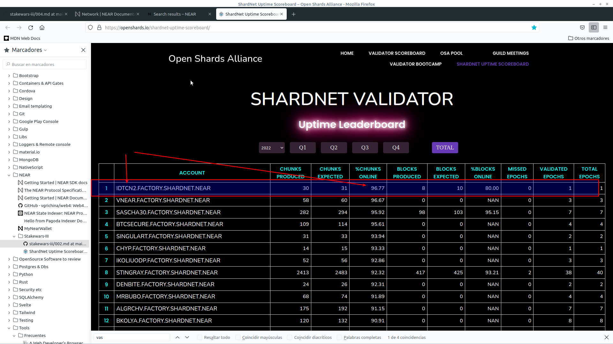

# Challenge 09

- Monitor uptime above 70% on ShardNet

- Open the RPC port 3030 for analytics / reporting

## Uptime scoreboards:

#### `Aug 21 2022` (after 61 epochs)
- 

#### `Aug 8 2022` (after 18 epochs)
- 

#### `Aug 4 2022` (initial)
- 

## Accessing port 3030

*IP**: `74.208.151.236`

Running from my desktop accesing remote `idtcn2` node:
~~~
curl -r -s -d '{"jsonrpc": "2.0", "method": "validators", "id": "dontcare", "params": [null]}' -H 'Content-Type: application/json' 74.208.151.236:3030 | jq -c '.result.current_validators[] | select(.account_id | contains ("idtcn2"))'
~~~

